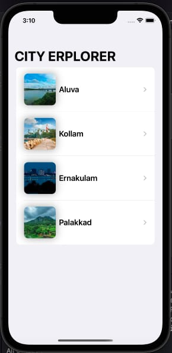

# 🏙️ City Explorer

City Explorer is a simple **SwiftUI** app that showcases beautiful cities in **Kerala**.  
Each city card displays an image and name, allowing users to explore destinations easily with a **clean and minimal interface**.

When a user taps on a specific city, the app displays detailed information including:
- ✈️ **Travel Tips**
- 🍴 **Local Cuisine**
- 🏰 **Popular Attractions**

---

## 📱 App Preview

*(Example: Aluva, Kollam, Ernakulam, Palakkad)*

---

## 🛠️ Technologies Used

- **Swift**
- **SwiftUI**
- **Xcode**

